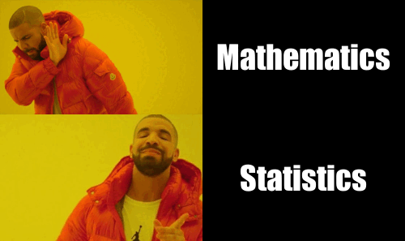

```{r setup, include=FALSE}
knitr::opts_chunk$set(echo=TRUE, message=FALSE, warning=FALSE, error=FALSE)
```

```{css}
body {
  font-family: Helvetica, Arial, sans-serif;
  margin : 0;
  font-weight: 400;
  background-color: #000;
  color: #FFF;
}

img {
  display: block;
  margin-left: auto;
  margin-right: auto;
  width: 50%;
}


```

## Project requirements
I used [Github](https://github.com/FJTDL/STATS-220) to a very simple level. It includes the README, as expected, but due to technical issues I did also end up using it for it's intended purposes; as a repository for my code. The images on the repo are now a little outdated though. Thankfully, I have been using Git and [Github](https://github.com/FJTDL/STATS-220) for a while, so utilising it wasn't especially *alien*. So, in aggregate, I have:

1. Created a repository for this project.
2. Added a README
3. Added the requirements for the README file those being:
  - Two different levels of headers
  - Use of two different bullet points (ordered and unorderd)
  - Use of both **bold** and *italic*.
  - Links to other websites

I have already included my Github link a few times, but have it again! Just in case it was needed explicitly 😉
  
Github link: https://github.com/FJTDL/STATS-220

I hope my project doesn't bore you!


## My meme

My inspiration was from the same meme we learned with. I initially considered other memes, but I came up with an idea that I really wanted to try.

At the surface level, this meme requires four panels: upper-left (which I dubbed drake hating), upper_right (hated_box), lower-left (drake liking) and lower-right (liked box).

However, I did want to make a few *altercations*.

The main thing, from my perspective, is that this template lends itself nicely to the [Thousand yard stare](data:image/jpeg;base64,/9j/4AAQSkZJRgABAQAAAQABAAD/2wCEAAoHCBYWFRgVFhYZGBgaHRkeGhocHBwfHB0eGhwhGhwcHh8cIy4lIR8rIx4hJjgmKy8xNTU1HCQ7QDszPy40NTEBDAwMEA8QHxISHzQrJSs0NDQ0NDQ0NDQ0NDQ0NDQ0NDQ0NDQ0NDQ0NDQ0NDQ0NDQ0NDQ0NDQ0NDQ0NDQ0NDQ0NP/AABEIAP4AxgMBIgACEQEDEQH/xAAbAAACAwEBAQAAAAAAAAAAAAAEBQIDBgEAB//EAEAQAAIBAgQEBAQEBQMDAgcAAAECEQAhAwQSMQVBUWEicYGRMqGx8AYTwdEUI0JS4WKC8XKS0hXCFiRjg6Ky4v/EABkBAAMBAQEAAAAAAAAAAAAAAAABAgMEBf/EACARAAMBAQADAAMBAQAAAAAAAAABEQIhEjFBA1FhInH/2gAMAwEAAhEDEQA/AGCmoPmVVtLGOhPM9BHpUlFeZJi0wQfUc6zbEkSUzf6yPrUpryiu0AeDV0GqMXNIh8TCelyfYXq5TNFBokTUdNTWpBJoAhFeINWaa7bpQBUVq/L5Um5sK6MOrUYix2obDK/ZFho2qYzdrmpZnA2gyKoGXNZmySPPmZNTR5qt8oRerMvhEc6AbQWiio4yyI271Vmc0EGw7XoIZp3M2jtQHtHXgGSZ73NA4uOxYnSQOVNVcRcCo4iIabdFnMAcI6hek2fSGpriJoJjahcVQbmkihfg4c9qZYWChW486Fc6a7hZq9MULMbJCbD9q9Ukx42Nep0UG35NdOEaNGHXDhiikQF01DTRpw64cKihBFxNlUGEbWDqVgo3Fwe9U5Piru2jQFMTN2mNzFiPU1oThVRi8PR2VmHiW4IJB+RuPOkUmv0D5dcTVLEFekQZ9P8ANGBKvTBqf5NOkwHQVdhoBXcTSg1Gl2JmWbsKTZWc/RuqnkLdq9mhpvyNUcOa/wARjpR+awFdDeG3FAwL+KUgA1YmKOQoTAykXYxV6YiyVEyI5GL99uVKjYS7giqRXGFQxJCkjehk+2ZvijtrIJqeHj7AbULnnvfeo4GKYjlSRoxp+cBY1YmN7CkmYc7zUMpnYaDTgqNM1mBf5Uu/iN6r4ljQxC7GPpQ+XBJvRBBwUspIG1CsYp/lQoTQB/yaHxuHTyopUEwavUzThp6V6jyCGqw1qbJVgw6nppmZQEr2miFSvaKAKNFc0XogpXdApAUKleYelEBKozKgLTAXZ/EDCBS9Emi8XDA86qGHSKC8omnaikxCSTyobDQ2ovDSmBYGrhFeigOOZg4eXxXFiEePMiB86UJbCRjIW0BgWG4BEjzq0oCI5V8qy2I6OGUkGVgg7mTMzN45d61mS/GuFZcVWVhuQJWfeR5USlSCvjalMQi8TavZZ7AUyzuPg5pWfCYAruGIB894+fOhchkjIFLPqMpkiki9VYGTQneDT/D4cdjEUuzWV0NTpMA85w0r4gxIO80flOGWkqatd9S25UYeIkYdlOoDtE8poYyAVMMhWdQSCdJ3gdKZYIUixBrBYpf+JDGSNEydyTED0k2ppwDNYgxH1DwaiBe8WJ36GdvKgbsNYuCK9UsvjBhK3HzHnXqcM6G6Klprk13VQByuV01yKQHgK7FeFdAoAkFoDOZm+lBqPM/pV2fxQLUtGJLGKCkvpRjEzcRU8BNW16IfBD9qLwckF2NMGzuHg2iuhKJIofNZpMNSzsFA6726DnSESK1kvxliAvhIWBQamxE1REaYYxeY1ADuabf/ABLgNh4jhiCgMK0BmJB06QDeY+VfNMfMg3j4iJjcg3sR/q2pjSDM7lQIKFjEAlrbRJjqb+1Ls5gw8SNhvJi16dY7NsW0z0EQxUDrsoafSlZSHJB1RMRb67DbzmkiivB8DKQoJm/kDsR13rW5XMQJ7Vjc0NIAUy3bqQKdZLK4os+5+4pgx+nGf7utMcd1dJsTFJMThyAXcT0FdwcUhSAdrCkoxdRY+NCNFtvWq8xxAJgu0ajpNvSl+edgI9aWJmHfwKslun7dapZpNLhmQAjliYQArO7EmbeVG4OdVFjUQS2p2tEnkB3Ee1KBl2w3BdGOi62tPL51B2hFVmGslnaDtyUGNjF47mp0ulp8H6cQgtpUttB1Mlr9CB0Edvb1Z/CzYBMao6nrzr1EYVH2mubXoNM2ZE7UUmOp5+lMzkKRi3m9EagBJ2pbmM0oeB613H4irLpFqRQWc0KEzXFFXnSTM5prwaGy+C7m81HkV4mhfFDi5jvWMzfEcVv5iqQBOkT/AEg3J7kU4z+AcJNbE3BAvzEGPYGs7nMQlNMbg8/7jJj0n3qk/oJBnAOLuCHPim+kneeXUXr6DkM0MREcCNQmDyOxHoRXy/Lm0qSqqT6nmT1AtHrTz8PfiZcMsj2SCyNc+InbsDM9r9adrDWeGm4pxtMFymks4UHkBfa9YfiOabGd8RzIBPP4YsAB0ufWd6AwndnLO5LvaSSSXJBY3/tB+VSy2V8Lh9QDMT0aIXSD7j3PWmCULs4iOhIA/luhJFjpMg/pQCKFOhttSkTFlBII9etXcQQqjIo3JmJmA5aT6AD1oZMUHSrbCJJvF5MUqAU+LrDajBJ8Ijnvc+VDqjCdQGo8ie/a243NGNho3j8YmSskeVxzm3vQTY4uouP7usff6Uii3LYOp1bmD8/sVoczjaVJis5lsdlZTtHL0pxmsfWg+dOEv2Kf4py3anfDhqHi3pNl0lq02QyYtBpslDD8lCsNHyirMhwzCRg6qNVxPY/e9VZnKlVDAz+hoNM4VaOdIBl+I+HJiYDTYgEqehGxr5ficS1hE032MCO3vX01s0CPEJHftevnmfyAOKzXVWc7dhvTU+j78C8rldQ0n+knaBvsIn3r1EZLwE8pA6787j0r1FHGbcuYvVb4hFxvyq7MYfIjvQmK4VCTyE1PaIpxcQ3JuevnS9cRmcRvNU/x7MIKwfOa5gZkr4pAPXpVAOcHDVCQYJO89ac5BAYcRHSsqksofXIPMH96ExeL4hAKOyKFBCg8zsSRy7VmvZUqL+O5svjFHbwq3hE2EEj3pViYcyTtEry3G1+v71PBwmYhmlmg3POwm/Xa/eo50lGUCYWfPv8AfaqfsqRFOZw/CWMTAAiZBYHraO/nQKYYlQZgD3o7OKRMHUCyyekHf53qCZb4jzO/Pf8AXtSTBqlqYa61ZZ8KkiTe8hj8/nVyu7uwY6VWTHU+HqbfDt3oXDRkcKokAbAjaZCdrgek0Vg5pIabM0zI3jf0E02wSRazBgYYAabrEG+97z97UkGEQzKf6THf7/zTdUSPUm3Y7+d6VuCpC7seY2HRQfL60ITJ4mYkQLjbytHvQmKNIBAk8h8vanGR/Duac6lwGAPN/CI/3xR+N+D82wthoO2tJgeZ+5oqRNRnFxYAneaKwc0Ig1ZmfwzmcPxPguBzIhx6lJEUqw0BB0mLkX5+n700waGuAL2p5luIlBEDlSHKYhCEEbGx+o/WptmuR3pwk2eFnDipAF67g8FJMnzrL5PPHrWu4VxHWhDGY2H1qXwr2AcQXQpPTfpWSszjU3iMkD+0jl051oOP5oHwi5vz+71jijvISQSd7DvubAb0l0FwZYmUZmjWFtqBxBAIPQxf/mvVMZzSApBeOQawnc16n0o3n/quWxWZUxAXwywK3G28SII7iofl6rxb96x34Twv5kgWYc973+/Kt7mHVBa9U0jP1wXngEzpX50g4hkNJKMIM1uMrnlIBoDO5I4j6isr1/WgEzCY2Hi4WGyLZXPxHuIIH3NEYWEERQQJYRFp+Eb9Tt71oPxFwlsUIMNgNJGoG1heQY3tSnP5ZlGoC8CJ7XipZeWRVSVUJIa4noZBPy51biIgOiQ8ASejdu8XqtYIW5JMTFgIABj1B96jmVRCqLbkzRI1bH51DNPYuzOKoLKoE7HUPDtJ9aswXLEsUMC/yP3aiEa0ggC4773N+VvpXUxXJM+FfLfmL/pReA10CyeJodw6wSAwM3Bg6dvWxqkZck69p3NvO1WYuA5Y6j3PtMT7U84JkcPCT+Jx1ESfy0bYkf1RzgiB79KqkaayS4V+G3ddeKxwkJBHN2HUDYA9/ais3xzK5QEYKKX21yC582N/QVl/xD+KcTGJAMJ86y7km/nQstmTbfs1mc/HGO3wx68qAP4rzJPxx5QP0pFHptUXB/aqWUKGy4b+NMbDf+a0p5X+VaHP8SyWPBxkBLbYijS4/wByiD/umvlTBmIsPemONmtOGEmYMmk8jPoR4PhLh+E/mYZ/rBuD/qHI/Kstxvhn5PjRtSkxfcUDwb8Q4mC0iGQ2ZG2ZTuIprxXHRlDKScNpK3uDzU9x15iKOpjQtyDFmEbz6Vr3dEgoNHhJJPeZN/lWQ4d8UitdksuMfAcPMiCH5z67im1SlwTZoaizTPmbXpcuGALnfkPYfT50RmcTQQP7bjlMc6WJm4YNpmJJ6G0CKEih9hYQWAOl/Xz+7V6h8ljCZZ41LIXTJF+d7V6pAKwUKEFSQehpi+cZhLH1q7iPDg6pyPy8qWPw59WkEECDv6R5/tVIl9D1zzCBMAVreFZwMorFvlHg2iBRnBM4yjxelFQNGpzygmfesvxdGdtCCYIk/OKfpmtQuLV5VVZIETU2+gShmCi4KAKLiw+Uzz9KWu4L7bm/3971ouJZYMS8g9opScEXt/imkvo6/gP4fEBGrnPlAA8ulU4uaiEmSJFtpP1uKOxMpKkxfkedLsPh0mNuhPzqYi6XYAVhobmflIkk+5pb+JuMnFeBZEGlFGwUWFG8Sw/y8NjEGwJ6zvWLd5JPeqSplr2W6/Suqu3T7vUUWd6Ly6eVU3BJFLqR3++1RGHNMPyYvUVS+335VPkOC98sw5/f39aicM+lOv4cn9vua5/AmPhk+vOjzDxYk/L00xyWY8BQmQbjsRaf0q1uGuBdGHKSDHnJEfOhf4UqSd6qpkxodcKwSTWuDKMOFOkDfqf8Ur4blhoXTzUH3FGnLyIqazSIz2YwGck/fzqs8P2E9PpP6Vqctw6T070S/B0Ig0UZm+G5PxMZBkWPbnYW3+lerTZPgouB/SziY3kg/fnXKQvJFeazyhSD1FjzBt+1U5TiKs8Qv9IEdgxv71ns/wAQ1hlKsWO17D9N6Ey2aKwTv89qpZ4JvpsON5pAlnUnoOwvS3hmL5GkeK4N7XorI4umIvPrejx5AvTb5YgqBPpVuOkCQZHesxhcS8IKXYmI79fKnCZlmS+53FDyK9B8xi0IjiSZruZbTcnrQNt+pifWl4j8grFxTsNqqzGMFKybkwO81TivpB1bG3eovjqdBKybADrJF/rFHjB+RL8SYbDLPPVfrFfPcMXr6jx/LM+Vxhz0Fo5+CH/SvmGVWT1qs+mLXsIw6Ow051Ujb6F1kbmwRe7MYAHnV5xAqzBxW/0A6B5FhBPeG7GpdYJILwkBvBPQDYR3NvnNEIhI1AKq/wBwE+7mB70lfjDCzIU8rt/3OJH+2Kpf+Y6XLTNyZPSL0vH9lKv1waYuZwROvGJPILqaf+yF9zQb5jBMacJ3/wCrQn/mT8qDxdCuRcnpF78qJTAxisphNAG5B+Q/anEkHj3rB8XOFfhw0H/ef/cB8qivGXB+FP8AsU/Wp48MLqVYbg/5+70uxErTMfsz0p6NbwDjxsjlSTJEWIMzojbbbbaL2p9j54sV0k2vYkD7vXzPBfSwbby68j6GD6VveFM2JhK4gGTa0CGIPl19qnanQy6abK8RQsFIgmx86Z4mKEXW/wANgee9ZvBZRBa8RIZdo5WMWM0xzOaJyxKr4SCI/tsRy96gujXgeMxTU9ixLAdATb6V2kGV4mwMAxCgCwiBt616mTTDYmaYAlYE64YCb6Sygk2kGi0QlQSCTAJtz0gnbzqvABLQCdPQxBtY3q/8xwbsVEGx+Xeq8hQ9iId9PlTbKZIthgiAx2m3IjpSH+IbV8ZiNpPK3n6U/wAg4D6tRuAIkwNPajyAYZHKqp0SmveDvHtterM7nlwmCOQpPw7kNy6dTXM8+hlaNpM/7AAD7k/7ay3HeKtiBQVKuhlTG3Y9jal9F00WaexlZEc+/wB/KqwV2mGXcyOW80ry3EEfDUOCCvIMRK6QwVvKYB3sKj/6zhkRhZfUwNpBcmefemA0zSAxyEfWIojKZcF1W2olSY5Ist7SFHqaW4OMxCs3hLFZQTAvOx5yKZ5HGAdm56UA9DPt+1AzRDAUo0xpZW8oIN/avjOOi4S6WOpzMqDAB2hiLwOgud5AjV9K/EfETh5ZtBhmARP90D6TXylzrdiTtN/Xf1n508oKE8PfUwL/AALcKLKvcDae+9OMDKtj4OIyEfmAroQkABZvE2LdzSvhqSI2ki9OMHDGGdYO3IzY+YrPepo3zn/MK8T8Pxl1dyA6yXgiNPITMFvLlS/hD6XDRIUncciKO4lnHxAQxIQ7jr0mocJSNfkIpPTjposqpIIxmGM4CKEAI1aANbD+ozufIdCaYLwnEGYJZwMteG1wQsWhp1a5jzNJWkOGG49q0OFxQOull0sRcHmeo5GobaXAeE30VDF1qyYpUuh8LGzESbH03rLtJm1ga1mdyawWNz16VmmWZHS8Vp+LS7DP8uHygor6NwPKBMLCQiG0l2t1MgT6/KsZwTJa8dFdbMy2PMG8kcxH1r6IcSSNtRUxb1n61e3eHOl9BcUQ5DHwlCy2MawCSvPY0xR1VRIPjU6iTcSIuPM0JnlZ0KrAjRBnYzaI5x5WbnQ2Jmpw1Sf50hSL2iQfWQJ86koJwMupVSTDaVMxIgjbzt8jXKt4fgPsDBAv1N78+teqaMxp4iEsMJpB3n/+dqrGcZ2uhUciQfaeVTxs1oJmGiDEKNQsZUxzBmjMYYLHECHUECMjRB0tEqRzhiRPQitPFInpRhrNz6TFqb5TFSLusg9duomk7KsRYWP0mhMjhhnBkLZxME3ZSq7Axc/KkkFNnxPMowhHRjIO8R4QDfbcVls/iDV4lljzB8JNvMgHtNQzGAy4oBaykSZMbjr3NaDNfk4eNh6gGeAYM6Vmyl4n0ty6btIGwLh/BJT8zEJQMpZUBuRpsxMWU2gbmeVOVVFhMMBBGyiO28b/ALUHxXiyJI0lVclQDcQAJfUJABJNpvv4byWMQH4SIAkbbbWpNsAfNja2529D/iqdcM2obj/I/arcR9REDm31j9RU0QFnJ+V9hNh9aKDA/wATsThIdwGWSOVjBPlB96wmAYbSedjX1jGyqYmWZCPiQGd4bcG3QjavlePg3Jme/wBKrL9oXqMJRypN7ztzEUcmIXAE+v3zpfhuWW9yLGRcdDNF8Kbfrao2uU6MusYZ3JnRbeQojqf8cqM4TkkZGJYhxY3gbTO21L85n4AUG/bafv60FlEcAlW0AzA9Y9L/AErPxbXWaray/QXlssS5UkwZg8rb/Krc2rJAMHv2pZk8TQRuCDJHWbE3vTfFdXSR0tPzo0mmC0mLszmnKlSbD58hTD8K8OGNjIHGpRJMixUWE9ixjvelCEhzIHhEwb7Gt/8AhrLBMIvcNiKXk/FA+AeVpA/1VcihnvVVAmwAufQiwbCLeq+AeQgbdqa48TaJCuO4iwoVlnMYLf8A0sX5MP8Ayq5kBbEJN9Av3Zf8j2oMSWiYAtCr6xqIj1Av50Hlcv8A/OO39ruxHKefzIPpRhxLueqr8xf77VDh7/zsQ2Gpn87wAP8A8TTAL4Vjs0mACsqTe8GPqpPrXKE4NjQjyI8bXneP8R716jxCmKx0wjEvta2Ku0kx8HeupmcFTIB9MQXHQym1qrzGGp2A9h+lUrhjoPbyp0UCcTiiSfA4EQAMUH6IJrmHxHDF0D8rM4BBHcofShHwucX/AOaljYEXAuN+gN7ffSnwXQ1uJqzSwnzxFg+cIDVuNxhXc4hRA5ABK4hEgAC/h7Cl6YW09uo6Tf1q1coBN+lHBwKfiKubhDtC65URtYrv/murxBYCqEMG11J5z/TtflFL1wIYE2Hj6cgYoBHAG1/S/Y2oSomzW8OzBdz4IsJIMgQ4JkBQAfEbnoKPw8UeNha6R5GAflWe/D+Kp1wukiJM25wf8Uy5MFMi173i3OlpFI0fD8wANPOE/wD1qngWVTCwSsTqVWYGDeLAdhMUrwOIEOiojGAS09QpNvvmaIyHEfzCygeCFKzAYGQNhsKkB7mOC4OKjIcJFZlMMqhSGvBlQJvFjXy7LysiY3mvrOXzQLyDER9a+bccwlTNYyKLa5A8/ER7mmhoX61n4S7DlMD1NENi4rKP5KETAlJoDQZsN6J/g8aJBPlPTtTaX00Wv4yGO5IGtNDcm5Hzj7vVqY5VfqO9DujbML1wAhb2oigWs1v4NyqO2M7orMoQJqEwx1EkdDYU9xM4RiaTtpMddhHzmgPwUqjLM5F2xCJNrgKAB71x2BxcSDZQkeZE/U1M6Z0KaNWG0wQmKvqSkVPFxVBIJHikRz+EBfoaAxcSHgX0qQd7azFuc+E1XhuTieEEtMwZupU78pmPnTgg0uJa5IAAJ6QIi3c/WhOGsCSzR4wxM7XMn9arzTFExQbEKoI31M5J3Fp8XyqOK6rgxLCwuNhYi5noentQAbwsEIDJklvD6Jf9K9QuKSCGAcDSAYgnVubdO8V2nWBmi+rzE+teVRp2vQbDpPOvYc9Wk9zVREB+Gkg9P+b967mUYydvER5gdaFVjsGIEda5rP8Ac3e5qWUg7Bw26X5TtyE3q0qoBZzEmd+UbdSe1KWcj+pvc1S7E7knzNHiDZbm88TIQQADc7mfpUPz3O4abchHp4flVWJ8Jjf7M/KrUOmCCymQJZAQQeljftVpKEv2NOA4ramUqS0AgMojffbfz70/wyqLrddTsToAEqIt0i5G3L3oH8MyxxPENlkOkEEmxGmAZ6dqlj4vjdY1ICLuWF46rsxJgT9az0+lpOcDIs7rBe3uVnTvbrS7JFV1OjAtPwl1BEwfiJiB53ntVuJha8LFddJCvdRq3MTezEXi9R4XwtMbE/LQarAs3xaUgEsv+om3nHepqB/0Z5PHs7syqmH8bC4AIkDfxMdgBF+lzWN4rm/zMV8ZZAZpAO4GwmPKtD+LcbSRlcJQuEpTSg0k62EEMw+I8yZMUgzGHDOuoNpYjUNjBIkdjVp/R4V4U4Wa9KvbNE/1R6UG2D0qeHknJgAk0NZ9mi8l8LnzIIAMVS7lvKrm4cV+OvDDgTypXPwazp+xx+GOI6NaMNS+GEJIAJYEvbZgFkGn+YyyYX5qK4xdbrJIMrI1QwG9oIixuORr5/hFtZ0kCd59a0/4bzwDNhYyhkxSoYmbGbFTFtPT1ptGDc0TfNIMRi7yCiKFE6fCWN4+EeLaiE4hgqZV9JM3UE8uluZ77UtxODqcQ6HOIg/6lIEkQdQHMG43onLcORWElLsBAI1cjuSR7xM1LSKTYPm82xRgW+NrAqZgN4Tq25+fvU+JYl9IJOpV6QRrb/xHtSwKTiBTMBvEdyLyfW1NsfKviKFUkMgBAIAENJ+MxeZ8POaqJCbofw7MsDrU6jBBWZidN+3w7d5tNdpfhYpwNzoY/FAJ8gdUCbHavUQV/wCiZgI964zDkIjaq9VonbtXNUbiiBS5BqkDsIHU2pgmVRkMA6+UMDJESItaDbypUHsRsfX61ouBOqCFR3exUA+GTYhpiLnfa1LXFSsquGaxMMgweXLpUMTDsI+71ucxhYeLZk+InSQRrF2g6udgLbEVmeMcMOA+nUGG4I5qSRP1FGdUlqCrWVEwD1na4K8vOvDFOj4mBmOxHbvXcYHQekj61NkIXSWBEz8PwnmeU/OtCRtwfMaCzKXUFQG13IJ6dZ5G0QaJzd3UpKFiS0SQxA8JM2DWM0Hw7EZiEXVjf2qF0xfxauo77XNanL5fBwFGJmP5j7jDW6AyTJAszXjaPlWWlHS/JLMBuBYROG7FimCCxLwrM8+HwSLf9Ww9IB+X4qEyxxMNGw1YsmApVdTeGzm8kBib8zS/M8dfNOmHq/KwpljKgBVFzIFrWvN2WqeKZhcTxB0KYcIgT4EUcgbknzualkp0zvE4R0UEkrOpjzbmfKTQ2C29XcTZSyaXD2ILDra8UKrQa0n+TXDhYzXpnkM8Iggg0r5i1E4Fj0qNJNdOjOmnwKx8XVahs6fCBVmG8nsKFzbyTSyuj3rhRgKSWAAJAm/MDceV6Z4+OpT8wsdbWWAQEJgzM7iDB5E2uJAOWSHbstxzNxI85o7Cxw6uj/BfQwHiBJDBT/cuo2O41Hkbas4tLoZwRMDFjAxAExL6MQDUrdiDb79/ZjJ42ACSodEO6KkL012kHYfQ0oxFKBHWRpaQekd/P6Vo85xZxpzCAFMRYcf6ha/URPypP+EJzgnfiOpgzhViItMcoEAHuO45158+SIBIW8yxO0XjrHWiTkcA4TYrHEC6hGGpkMxDNeBZRp36HlvSjEVQScM60iYYDWALmQNxafKqUY6PctxLDiNBbqS7ST1jV36CvUmwc6seIeWm0AcoI2vvXqPEdJ5bJsf6hE7SJ9qavlUJlR4dJgNYyIlT02NVLgDBCHWjnEkgidK6WAB2vN/ap5zUPCpnTYgGzAaoKkdZNQ+spHMPhwbEBWAoIksQFkkgC/I/pTLBxQmtMAWCkOpubMAH8ypv3Qnmah+GMPUjktABMg/DDLpPin/pt+9ew8DQutXdDo1YhGmZAMx1G59QNxUa+oacaYC+YZcbDeCQyD4b7SkR1EX7CiOONrTDdCpglSEYOAWEqomLAL05mucLyoVTj4kXnRIAsYGsCeeocjE96lxDPMYQoCUYEoQAZ0nSBM3Ivy7Xmml+hN9ooxcqpBVyA8SAnUE72ty+dSyPB9bgu/5SbjUrEnoFUfWfepYeMuvW6+Iki3wLGwAM3vv39aszfECzIWUG0gnlBhtufP1q1UZ60n6DsfiK5ZNOEvhuC+5J3kyPYcqU4uOjJrDEkmWFx5BRtEVzFzIdGXkDHL0Pn370FlUG084I9LmmlysldCcO6MsSGgQTPOR3nv2riKUxNC3wyQpXkQ5tq6mYPaBVmXYAFTGpZE9RaPvyqzJszOyOYJkof9U6lN/9QHvSbhaQOo/NYabKs72uO3t3tUsTKGbC4sf0PqPmDRGJhxh4TgAawWMdfCGHo013DeDfyPl19P3qHpo6fx5TzTmV4a7hpsYleh7UM+XcGCpnpTrAdgenao5tpg86hbdOnwUBUyZCAD4jdj07VPD4Wd7TI3PvUdR51x8YgRPL7++9Kug8qA+JldGIR8WpeXdhNW4OW8LCYJZ9O0kIBIv3Ye1UZZ5xJPJSb+YP351bxZgr4KiIClj/APcYz6QorRV8OH8kWmSxHR8FkIhliBymR8/3qGSxhofDbaQL2gN/mqczNh1nttAHn59qHRrOepHy6VeVwzY//DyK4bCxXKpIYREyRESeVQz/AA7LK5CO8gxsp+K19pEd+otQmHmPy0ZjIZYIgA3JAmDYkBpuIvXc1Z0YEEuhkhYBm0wNjEm1qlLtLev8wjmuDMp1IPzkNgyAkgjdWAuCO9co7I8RfAOpHARgbEEidRjYiDvXquszoFlgiqUdSf7DOki4JBjfp60RhorxsCTABPIct5Jib25WNA5vLk+INveD5Kf/AH/Krcvhlkw2n+ZPhPKNQEMdyN/elKqaWD7ATQoTQkECTqUg84PNVk84H0pTns2XcCAcFCCyBYWRawkgqDB79DQ3EM5iLGGzbk7XmLXJi1toqeBjxhFet57dKlZa6D1We4pxLW6iJXDAIgxqLBXJ8hAEdjUstjHEbEzGIYJFoBtysJ6QJ6A0qZdbKswGN/p/n1o/NmFQLYNaOw2n5fOriSiMtabYC8KF5TJMiYmywOtvnV+WfU0MLIxkRe4uPcUNjPqdOQhR13ri4xGJA5nQSbyD/wAVUqJO5gBHZJ7ftNUhtJExvv271LOMSyk9B7gxNRxxcdDH/FNLg70KZoxFIIhtJE+ZEn75Ubm1C4yONgQGM3B1e4i2/Wgc0sIDzBInnY2+u1F4xL3JMuqg/wDVIhvp7Vm/hYTmIsBsrPHk/j+ur2rmAOo96pyuNq1He+GQTYmFYSQDAN+XSjMNbxWe1OHV+B8L8IciNtvIbedqpxhLRVrJ8J+9p+/OvafF99axv06V3hT+XG9DOwnt9/4phiCFI7Gh3wRHl+9PLDWe8F2UAOI3ZRNp/q2+XyqHGcyHxXIIhdKr3CDT9+ddyrEHFYcl/cj6UuwE1aj06+1dOV2nnfkfRlnnUhHH9Qk+YAH1qGTA0kkiAQYPPsas/IkAcpH0k1fwrALBoMAAW/zRUkT9OZdw40nZhcct7en7CgihhZ/o1r6A2PuSKvwrGDuDuD3qWZUnVe37gfrehcYmU4GLYA9JHl/zNeqnAwpO/I/IxXqqID//2Q==)
which is usually in a video format. In particular, I remembers memes with similar meaning where the nice alternative evolves into something even more terrifying.

With this in mind, I thought about the thing stats and maths majors alike fear: probability.
Math students fear it because it is indeterminate, stats majors fear it because they actually have to do maths.

This involved the development of the four panels as mentioned earlier, which were paired off into vectors
based on the row they belonged in. The drake images were sourced from online, and I got frames which didn't need cropping
as an added bonus. The boxes were even easier, as it just involved piping the `image_blank` results into `image_annotate`.

The "twist" was a little harder, as although getting the stare image and the box made was easy,
the animation was **hell**.

I tried to pass both the bottom vector and the twist vector into a third vector and pipe that into the `image_animate`  function, but it failed horribly.
Many hours, swears, breaks and coffees were consumed as I wasted time on this idea.

I was messing around on the documentation when I discovered the composite function, and then it was much easier, and it is what you see now.
So those hours weren't completely wasted, but mostly 🙃
```{r meme-code, eval=TRUE}
library(magick)

# Drake hating
drake_panel_1 <- image_read("https://i.ytimg.com/vi/wAbnNZDhYrA/maxresdefault.jpg") %>%
  image_scale(250)

# What drake hates
hated_box <- image_blank(height=141, width=250, color="#000") %>%
  image_annotate(text="Mathematics", color="#FFF", gravity="center", size=40, font="Impact")

# Drake agreeing
drake_panel_2 <- image_read("https://www.telegraph.co.uk/content/dam/music/2016/11/30/drake_trans_NvBQzQNjv4BqZPnXlBHEdt8AtjizIYNgmZhw_iIPZqUNP2EjAIFcGyw.jpg") %>%
  image_scale(250)

# What drake likes
liked_box <- image_blank(height=156, width=250, color="#000") %>%
  image_annotate(text="Statistics", color="#FFF", gravity="center", size=40, font="Impact")

# Creating the top and bottom vectors
top_vector <- image_append(c(drake_panel_1, hated_box))
bottom_vector <- image_append(c(drake_panel_2, liked_box))

# Animating the first bottom bar vector
bottom_image <- image_animate(bottom_vector)

# Combining the vectors into one
total_vector <- c(top_vector, bottom_vector)
my_meme <- image_append(total_vector, stack=TRUE)

# Saving the static meme
image_write(my_meme, "static.jpg")

my_meme

```


```{r animation-code, eval=FALSE}
library(magick)

# Drake hating
drake_panel_1 <- image_read("https://i.ytimg.com/vi/wAbnNZDhYrA/maxresdefault.jpg") %>%
  image_scale(250)

# What drake hates
hated_box <- image_blank(height=141, width=250, color="#000") %>%
  image_annotate(text="Mathematics", color="#FFF", gravity="center", size=40, font="Impact")

# Drake agreeing
drake_panel_2 <- image_read("https://www.telegraph.co.uk/content/dam/music/2016/11/30/drake_trans_NvBQzQNjv4BqZPnXlBHEdt8AtjizIYNgmZhw_iIPZqUNP2EjAIFcGyw.jpg") %>%
  image_scale(250)

# What drake likes
liked_box <- image_blank(height=156, width=250, color="#000") %>%
  image_annotate(text="Statistics", color="#FFF", gravity="center", size=40, font="Impact")

# Creating the top and bottom vectors
top_vector <- image_append(c(drake_panel_1, hated_box))
bottom_vector <- image_append(c(drake_panel_2, liked_box))

# Animating the first bottom bar vector
bottom_image <- image_animate(bottom_vector)

# Combining the vectors into one
total_vector <- c(top_vector, bottom_vector)
my_meme <- image_append(total_vector, stack=TRUE)

# Saving the static meme
image_write(my_meme, "static.jpg")

# Twist
thousand <- image_read("https://i0.wp.com/www.the-american-interest.com/wp-content/uploads/2016/09/Tom_Lea_-_2000_Yard_Stare.jpg?fit=1000%2C634&ssl=1") %>%
  image_scale(250)

# The thing worse
hellish_box <- image_blank(height=156, width=250, color="#000") %>%
  image_annotate(text="Probability", color="#FFF", gravity="center", size=40, font="Impact")

# Creating the second bottom vector and animating it
second_bottom_vector <- c(thousand, hellish_box)
second_bottom_image <- image_append(second_bottom_vector)
bottom_line <- image_animate(c(bottom_image, second_bottom_image), fps=1)

# The final meme requires the animated vector to be composed on the top
final_meme <- image_composite(my_meme, bottom_line, offset="+0+141") %>%
  # This line cleans away the "Preview 1/2" bar
  image_animate(fps=1)

# Saving the gif
image_write(my_meme, "meme.gif")


```


## Creativity

I think creativity is in taking something simple, and making it unusual. The original meme with just Drake is very old at this point, but while I have seen similar memes that use the idea of "oh no the better option actually requires something worse" I've never seen it quite done with this format in this way. I've seen it in ways where there are extra panels added after the standard four, but those usually end up creating an incredibly long meme that requires people to zoom in with their phones. This format is one I haven't seen before, and it doesn't involve needing to zoom in to read text or see the next section.

## Learning reflection
Markdown has always been something I've heard discussed during my time programming, but has never been covered, and it got to the point I even started to blur it with HTML. However, having actually learned it now I see how much faster it is to use than HTML and that being able to convert that into a web page, even if not used on a website, is an excellent way to display visualisations and communicate findings.

Having done some work with HTML and web scraping in my own time, I'm very interested in learning how this works in R, especially as now that I have a better understanding of markdown, I hope that it will help me better understand the structure of web pages and how to extract the information I need from them.
